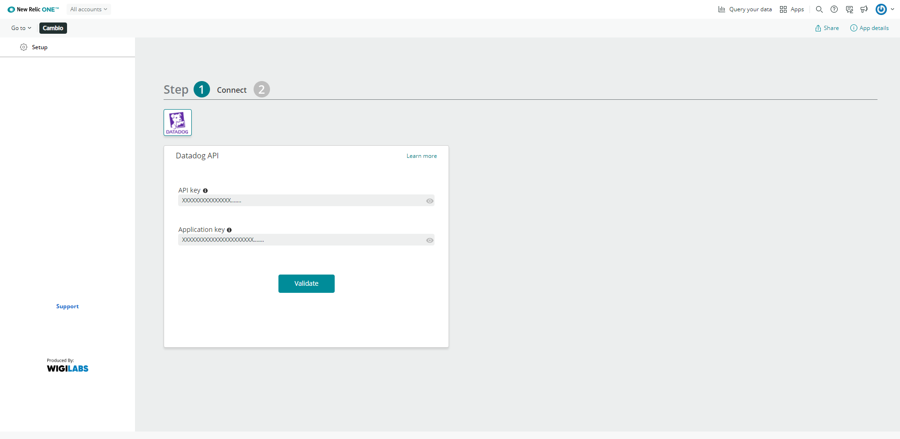
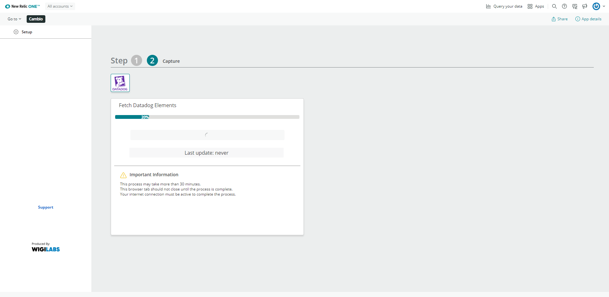
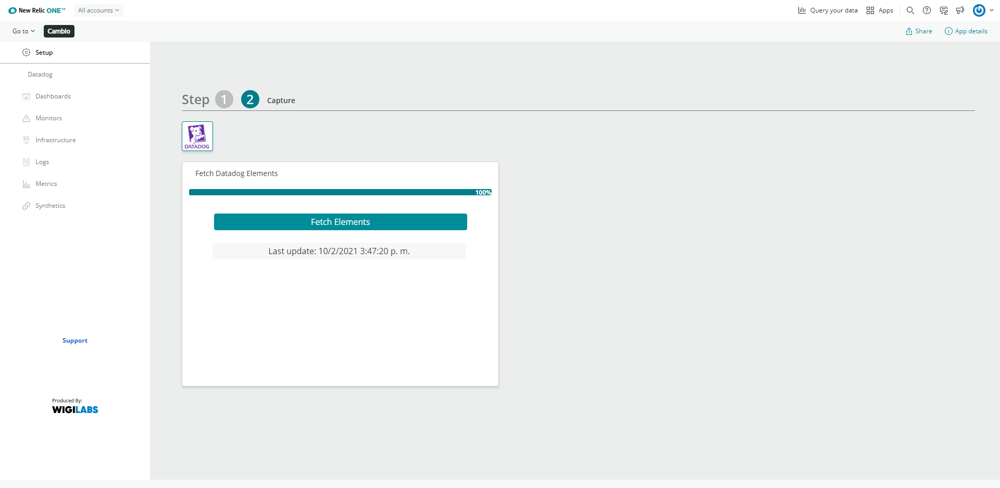

[](https://opensource.newrelic.com/oss-category/#new-relic-experimental)

# nr1-cambio

  
Allows you to connect to the Datadog API and show you important information such as your Dashboards, Alerts, integrations and much more

## Usage
Enter you api keys from datadog,these will be saved in [NerdStorageVault](https://developer.newrelic.com/explore-docs/nerdstoragevault)



Once validated, press the continue button and then the fetch elements button




When the process is finished you can navigate in the different sections located on the left of your screen




## Install

First, ensure that you have [Git](https://git-scm.com/book/en/v2/Getting-Started-Installing-Git) and [NPM](https://www.npmjs.com/get-npm) installed. If you're unsure whether you have one or both of them installed, run the following command(s) (If you have them installed these commands will return a version number, if not, the commands won't be recognized):

  

```bash

git --version

npm -v

```

  

Next, install the [NR1 CLI](https://one.newrelic.com/launcher/developer-center.launcher) by going to [this link](https://one.newrelic.com/launcher/developer-center.launcher) and following the instructions (5 minutes or less) to install and setup your New Relic development environment.

  

Next, to clone this repository and run the code locally against your New Relic data, execute the following commands:

  

```bash

nr1 nerdpack:clone -r https://github.com/GlobalsoftWigilabs/nr1-cambio

cd nr-cambio

```

This nerdlet has a configuration file located at:

**nerdlets / cambio-nerdlet / services**

Where should be placed a proxy address (configured to resolve the cors block) and an access link to the microsoft teams webhook for messages sent from the support form.

 e.g:
```
{
    "proxy":"https://long-meadow-1713.rsamanez.workers.dev/?",
    "webhook_url_teams":"https://outlook.office.com/webhook/........"
}
```
Execute the following commands:

```
nr1 nerdpack:uuid -gf

nr1 nerdpack:serve
```

Visit [https://one.newrelic.com/?nerdpacks=local](https://one.newrelic.com/?nerdpacks=local), navigate to the Nerdpack, and :sparkles:

  

## Deploying this Nerdpack

  

Open a command prompt in the nerdpack's directory and run the following commands.

  

```bash

# To create a new uuid for the nerdpack so that you can deploy it to your account:

# nr1 nerdpack:uuid -g [--profile=your_profile_name]

  

# To see a list of APIkeys / profiles available in your development environment:

# nr1 profiles:list

  

nr1 nerdpack:publish [--profile=your_profile_name]

nr1 nerdpack:deploy [-c [DEV|BETA|STABLE]] [--profile=your_profile_name]

nr1 nerdpack:subscribe [-c [DEV|BETA|STABLE]] [--profile=your_profile_name]

```

  

Visit [https://one.newrelic.com](https://one.newrelic.com), navigate to the Nerdpack, and :sparkles:

## Issues / enhancement requests

Issues and enhancement requests can be submitted in the [Issues tab of this repository](../../issues). Please search for and review the existing open issues before submitting a new issue.

## Contributing

Contributions are encouraged! If you submit an enhancement request, we'll invite you to contribute the change yourself. Please review our [Contributors Guide](CONTRIBUTING.md).

if you have any questions, please drop us an email at opensource-cambio@wigilabs.com.


## License

This project is distributed under the  [MIT license](https://opensource.org/licenses/MIT).